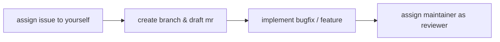

<div align=center>
<h1>Python Project Template</h1>

[][docs]
[][sample project]
[][pypi]

</div>

[pypi]: https://pypi.org/project/init-python-project/

<!-- start -->

A customizable template for new Python projects to get you up and running with current best practices faster.

## Features

- Each project has a *README* and *CHANGELOG* file and includes further documentation based on [Material for MkDocs][] or [Sphinx][].
- *Testing* and *continuous integration* tooling are included from the very beginning
    - Test coverage is collected and displayed as a badge
    - Coverage report is integrated with [Gitlab's coverage report artifact][gitlab coverage report]
- Projects use [pre-commit][] for sanity checks on each commit or push
- Projects use bumpversion to increase their version according to [semantic versioning guidelines][semver]
- Python projects are installable by default and provide a simple command-line interface

[material for mkdocs]: https://squidfunk.github.io/mkdocs-material
[sphinx]: https://www.sphinx-doc.org
[gitlab coverage report]: https://docs.gitlab.com/ee/ci/yaml/artifacts_reports.html#artifactsreportscoverage_report
[pre-commit]: https://pre-commit.com/
[semver]: https://semver.org/

Everything comes pre-configured with sensible defaults so you can focus on your implementation and let the template handle the rest.

See the [sample project][] to see how projects generated from this template using default values look like.

[sample project]: https://git01.iis.fhg.de/mkj/sample-project

## Getting Started

### Prerequisites

* Python3.11 or newer

### Installation

```sh
pip install init-python-project
```

*Note: If you have [pipx][] installed (you should, it is good), you can skip this step and instead run it directly using `pipx run init-python-project`*

[pipx]: https://pypa.github.io/pipx/

### Usage

```console
init-python-project <name of project>
```

<!-- usage-end -->

## User Guide

The first part of the user guide consists of tutorials on how to answer the template questions for [Your First Project][], what [Next Steps][] there are after your project is created and why the [Project Structure][] looks like it does.

[docs]: https://mkj.git01.iis.fhg.de/project-template/
[your first project]: https://mkj.git01.iis.fhg.de/project-template/user-guide/first-project
[next steps]: https://mkj.git01.iis.fhg.de/project-template/user-guide/first-project
[project structure]: https://mkj.git01.iis.fhg.de/project-template/user-guide/project-structure

The second part of the user guide explains how best practices, like [testing][], [documentation][], and [continuous integration][], are implemented in this template.

[testing]: https://mkj.git01.iis.fhg.de/project-template/user-guide/topics/testing
[documentation]: https://mkj.git01.iis.fhg.de/project-template/user-guide/topics/documentation
[continuous integration]: https://mkj.git01.iis.fhg.de/project-template/user-guide/topics/ci

## Contributing

Every kind contribution is appreciated. Here is a list of ways to contribute (from easy to more involved):

- [report a bug][new issue]
- [open issues with feature requests (or other feedback)][new issue]
- [improve documentation][docs]
- [review open merge requests][mr]
- contribute a bugfix or feature

### Working on Issues

Have a bugfix or feature you want to contribute? That's exciting!

If you are unsure about how to contribute changes, here is how I tend to do things:


*Note: Feel free to do what works for you (e.g. fork & merge request to upstream)*

If you are unsure about how to go about implementation, we can discuss the issue.

[new issue]: https://git01.iis.fhg.de/mkj/project-template/-/issues/new
[mr]: https://git01.iis.fhg.de/mkj/project-template/-/merge_requests

### Reviewing Changes

When you are reviewing a merge request, please leave a comment at the end of your review session indicating the scope of your review.

<details>
<summary>Example: Comment at the end of a review</summary>
I can confirm this works on Windows! I tested project creation and successfully created a project with default values. I did not look at the individual changes in this MR.
</details>

If you did a full review (i.e. review changes, verify on your machine, ...), you can additionally `Approve` the MR when you are done.

If you want to learn more about the review process, have a look at [Google Engineering Practices Documentation](https://google.github.io/eng-practices/) which includes the [Code Reviewer's Guide](https://google.github.io/eng-practices/review/reviewer/) and the [Change Author's Guide](https://google.github.io/eng-practices/review/developer/).

## Known Issues

* Do not start your project name with `test`. It will mess with [`pytest`'s automatic test discovery mechanism](https://docs.pytest.org/explanation/goodpractices.html#conventions-for-python-test-discovery). If you want your project to be named test, you have to configure pytest accordingly.
